<!-- PATH: 0_docs/0_methodology/3_operation.md -->

# ⚙️ Etapa 3 — Operação na Plataforma (Coursebox.ai)

# 🎯 Visão Geral

Nesta etapa, você irá transformar as **Notas de Aula estruturadas** (geradas na Etapa 2) em um **curso completo dentro da plataforma Coursebox.ai**.

O foco aqui é operacional: configurar corretamente os inputs para garantir que a IA gere um curso **coerente, didático e alinhado ao objetivo pedagógico**.

> 🚨 **Princípio-chave**
>
> A qualidade do curso gerado depende diretamente da qualidade e da configuração dos insumos.
> *(Garbage In, Garbage Out)*

# 📌 Índice

- [⚙️ Etapa 3 — Operação na Plataforma (Coursebox.ai)](#️-etapa-3--operação-na-plataforma-courseboxai)
- [🎯 Visão Geral](#-visão-geral)
- [📌 Índice](#-índice)
- [🔐 Acesso](#-acesso)
  - [🧭 Navegação Geral](#-navegação-geral)
- [🚀 Execução do Processo](#-execução-do-processo)
  - [🔑 Login](#-login)
  - [➕ Criar Novo Curso](#-criar-novo-curso)
- [⚙️ Configuração do Curso](#️-configuração-do-curso)
  - [📂 Carregar Conteúdo](#-carregar-conteúdo)
    - [✔ O que enviar](#-o-que-enviar)
    - [🧠 Configuração essencial](#-configuração-essencial)
  - [🎯 Audiência](#-audiência)
    - [✔ Exemplos](#-exemplos)
  - [🧩 Estrutura](#-estrutura)
    - [✔ Verificação obrigatória](#-verificação-obrigatória)
    - [⚙️ Parâmetros Fixos](#️-parâmetros-fixos)
    - [📌 Ajuste específico (PLIA-DF)](#-ajuste-específico-plia-df)
  - [⚙️ Configurações](#️-configurações)
    - [✔ Ação](#-ação)
  - [🧠 Prompt Geral](#-prompt-geral)
    - [✔ Objetivo](#-objetivo)
    - [📌 Estratégia](#-estratégia)
    - [⏱️ Definição de duração](#️-definição-de-duração)
    - [🧾 Modelo de Prompt](#-modelo-de-prompt)
  - [👁️ Revisão Pré-Processamento](#️-revisão-pré-processamento)
    - [✔ O que validar](#-o-que-validar)
    - [✔ Ação do operador](#-ação-do-operador)
- [🔎 Material Suplementar](#-material-suplementar)
- [✅ Encerramento](#-encerramento)
- [🔄 Resultado da Etapa](#-resultado-da-etapa)
- [⏭️ Próxima Etapa](#️-próxima-etapa)

# 🔐 Acesso

Acesse a plataforma:

👉 https://www.coursebox.ai/pt

O acesso será realizado via **conta compartilhada da equipe**.

> ⚠️ **Atenção**
>
> Utilize exclusivamente a conta designada.
> Isso garante rastreabilidade e evita bloqueios por autenticação em dois fatores.

## 🧭 Navegação Geral

A interface apresenta:

* Lista de cursos existentes
* Opções de configuração
* Botão de criação de novos cursos

# 🚀 Execução do Processo

## 🔑 Login

<!-- Ilustração - print da tela -->
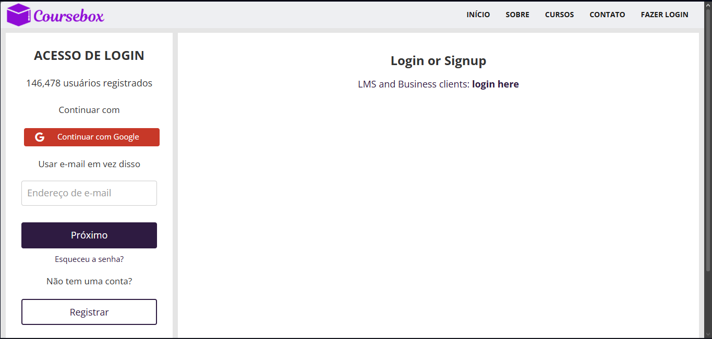

Insira:

* **Login:** (conta institucional)
* **Senha:** (fornecida pela coordenação)

## ➕ Criar Novo Curso

<!-- Ilustração - print da tela -->
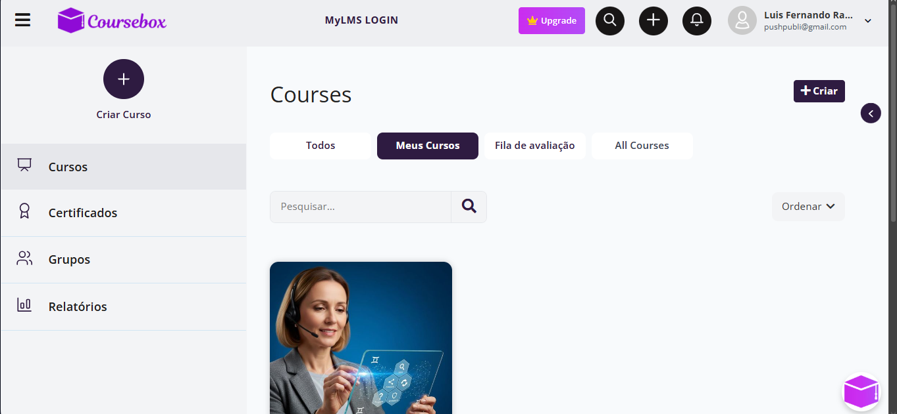

Na página inicial:

1. Localize o botão **"Criar Curso"** (ícone **+**)
2. Clique para iniciar

<!-- Ilustração - print da tela -->
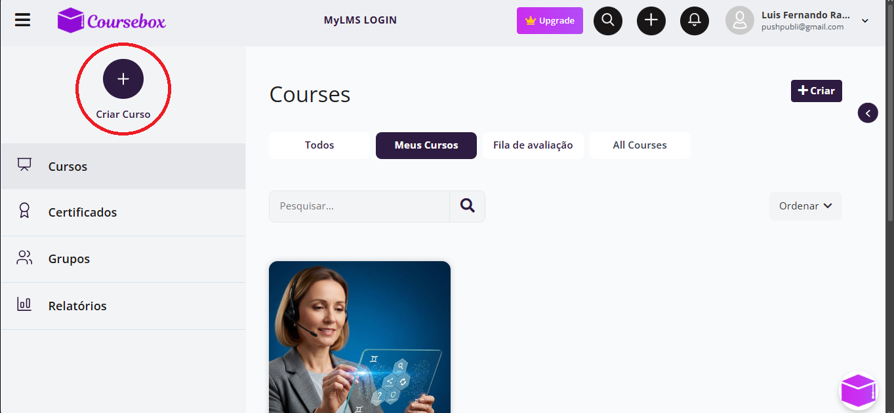

# ⚙️ Configuração do Curso

Após clicar em **"Criar Curso"**, você verá a tela principal de configuração:

<!-- Ilustração - print da tela -->
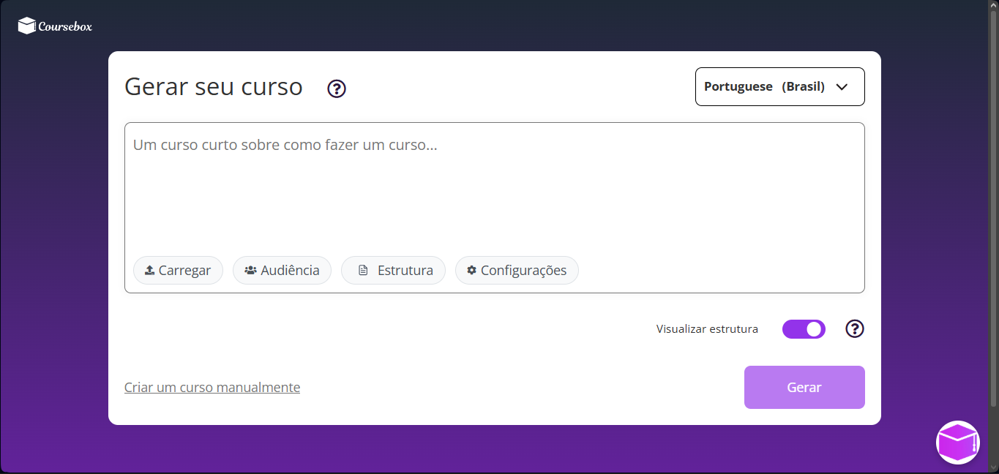

> 📌 **Ordem recomendada de preenchimento**
>
> 1. **Carregar**
> 2. **Audiência**
> 3. **Estrutura**
> 4. **Configurações**
> 5. **Prompt Geral**

## 📂 Carregar Conteúdo

<!-- Ilustração - print da tela -->
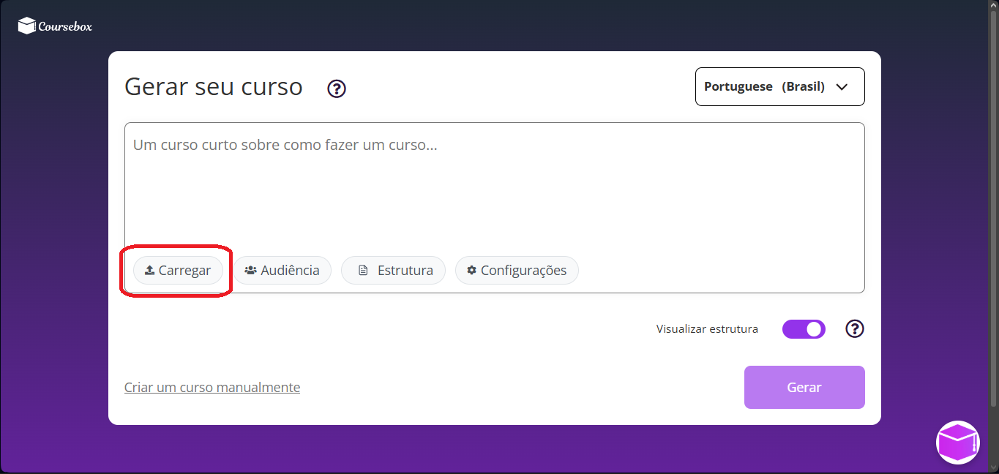

Esta é a etapa **mais crítica**.

Clique em **"Carregar"**:

<!-- Ilustração - print da tela -->
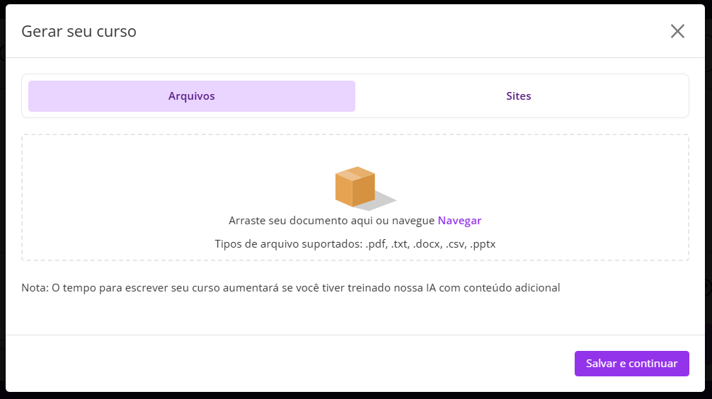

### ✔ O que enviar

1. **Notas de Aula (obrigatório)**

   * Arquivo: `aula_01_notas_v1.md`
   * Criar cópia em `.txt` antes do upload

2. **Documento de referência (opcional e seletivo)**

   * Apenas trechos relevantes definidos na Etapa 1

> ⚠️ **Atenção Crítica**
>
> Não envie documentos completos sem triagem.
> Isso degrada significativamente a qualidade do curso gerado.

### 🧠 Configuração essencial

Após upload, marque:

**"Usar como Estrutura do curso"** no arquivo de Notas de Aula

<div align="center">
  
</div>

## 🎯 Audiência

<!-- Ilustração - print da tela -->
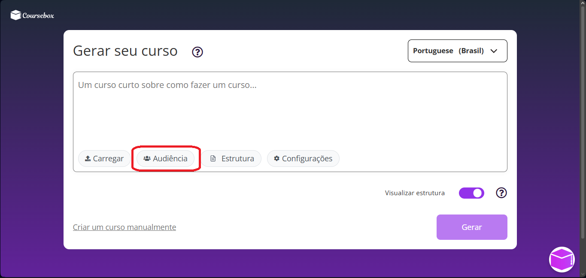

Clique em **"Audiência"**:

<!-- Ilustração - print da tela -->
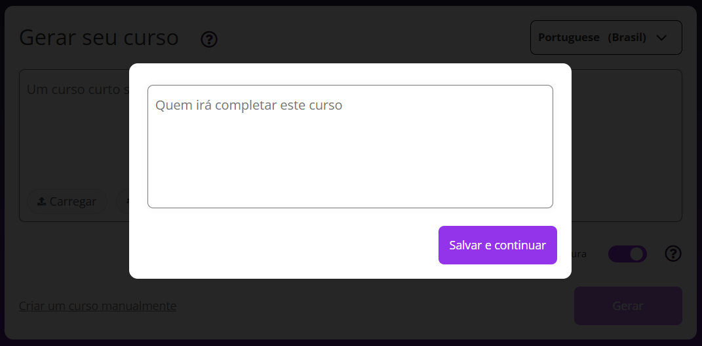

Defina claramente o público-alvo.

### ✔ Exemplos

**ARCTEL — Lideranças Femininas**

```text
Profissionais do setor de telecomunicações e regulação, oriundas de países lusófonos, com interesse em desenvolvimento de liderança e tomada de decisão estratégica.
```

**PLIA-DF — Professores**

```text
Docentes do Ensino Médio da rede pública do Distrito Federal, de diferentes áreas, com interesse em aplicar conceitos de Inteligência Artificial na prática pedagógica.
```

> 📌 **Nota**
>
> Quanto mais claro o público, melhor a adaptação do conteúdo pela IA.

## 🧩 Estrutura

<!-- Ilustração - print da tela -->
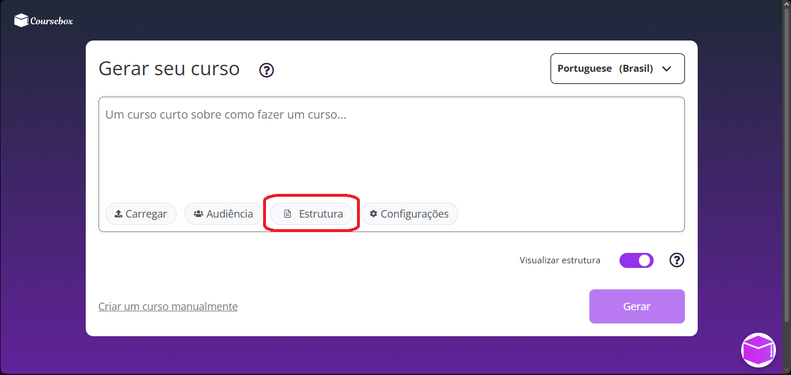

Clique em **"Estrutura"**:

<!-- Ilustração - print da tela -->
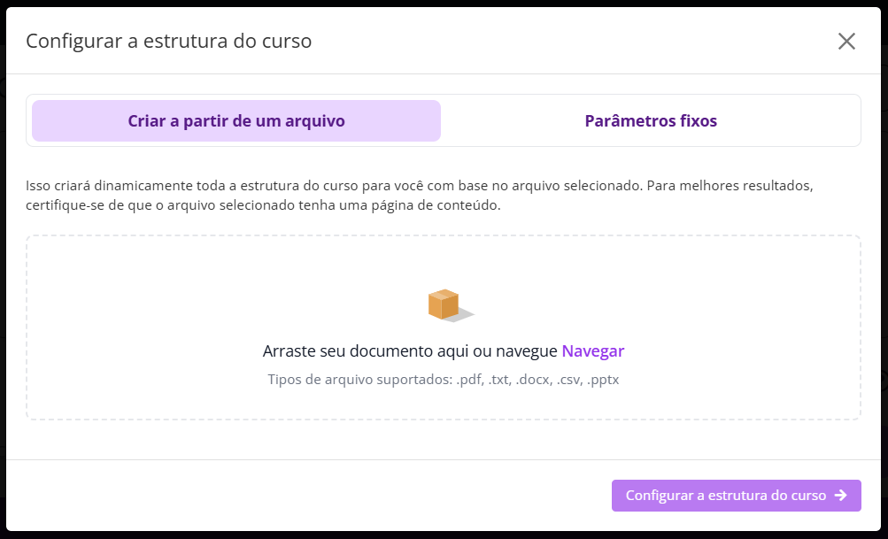

### ✔ Verificação obrigatória

* Confirme que o arquivo de Notas de Aula está marcado como:
  **"Usar como Estrutura do curso"**

### ⚙️ Parâmetros Fixos

Clique em **"Parâmetros Fixos"**:

<div align="center">
  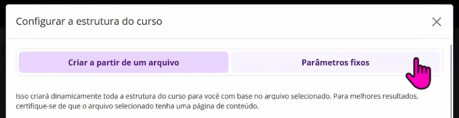
</div>

Configure:

* **Seções:** 5

### 📌 Ajuste específico (PLIA-DF)

* **Tarefas por Seção:** 3

<div align="center">
  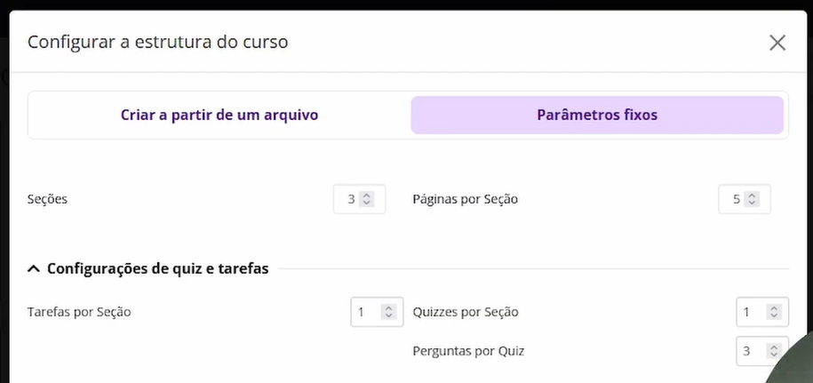
</div>

## ⚙️ Configurações

<!-- Ilustração - print da tela -->
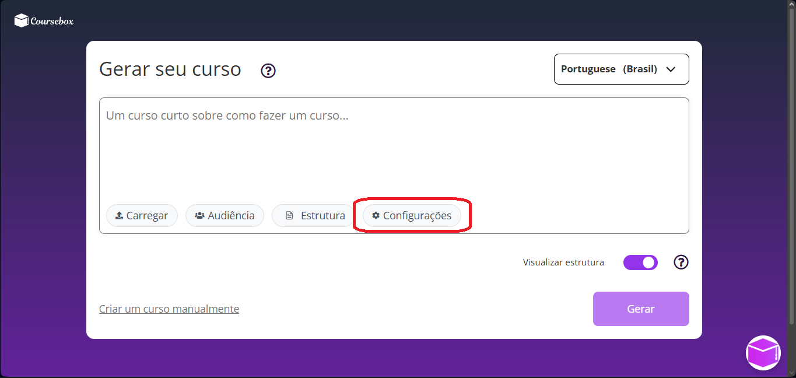

Clique em **"Configurações"**:

<!-- Ilustração - print da tela -->

<div align="center">
 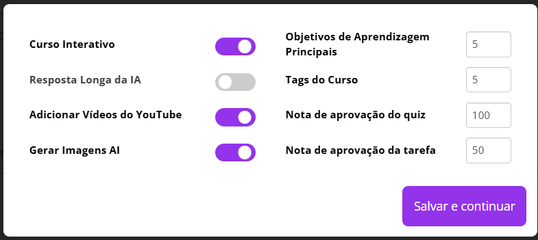
</div

### ✔ Ação

Compare os parâmetros com a imagem e replique exatamente.

> ⚠️ **Atenção**
>
> Pequenas diferenças aqui podem alterar significativamente o comportamento da geração.

## 🧠 Prompt Geral

Retorne à tela principal:

<!-- Ilustração - print da tela -->


### ✔ Objetivo

Refinar o prompt automático gerado pela plataforma.

### 📌 Estratégia

Utilize o conteúdo de:

`aula_01_notas_v1.md`

Para construir:

* Resumo estruturado
* Tópicos principais
* Definições essenciais

### ⏱️ Definição de duração

* **ARCTEL:** 1h30 – 2h30
* **PLIA-DF:** 2h – 4h

### 🧾 Modelo de Prompt

```text
# Contexto
Este curso faz parte da trilha {módulo/ferramenta} do programa {ARCTEL ou PLIA-DF}.

# Duração
{Definir conforme padrão}

# Público-Alvo
{Inserir descrição definida anteriormente}

# Conteúdos Esperados
{Listar tópicos principais das Notas de Aula}

# Diretrizes de Geração
- Linguagem formal e direta
- Evitar rebuscamento
- Inserir exemplos práticos
- Criar atividades formativas
- Incluir quizzes focados em conceitos fundamentais
- Utilizar imagens criativas sem infantilização
```

> 📌 **Nota**
>
> O prompt é o principal mecanismo de controle fino da geração.

## 👁️ Revisão Pré-Processamento

Antes de gerar o curso:

Ative o switch:

**"Visualizar estrutura"**

<!-- Ilustração - print da tela -->
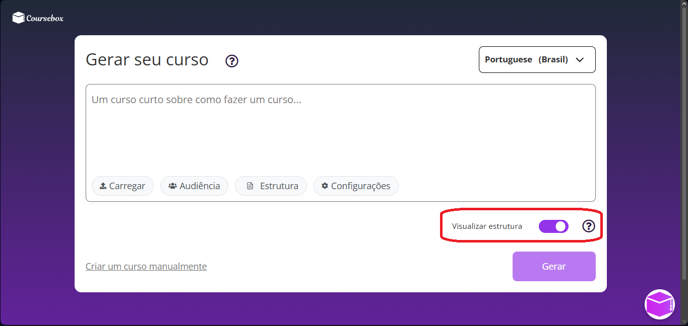

### ✔ O que validar

A plataforma irá sugerir:

* Estrutura de capítulos
* Títulos de páginas
* Atividades e quizzes

### ✔ Ação do operador

* Corrigir incoerências
* Ajustar títulos
* Validar progressão lógica

> ⚠️ **Atenção Crítica**
>
> Não avance sem revisar.
> Erros aqui se propagam para todo o curso.

Exemplo:
<!-- Ilustração - print da tela -->
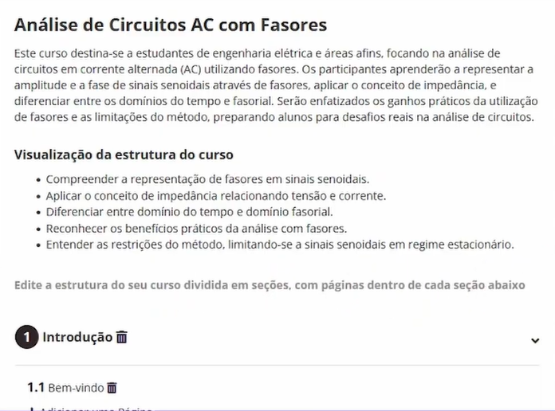

# 🔎 Material Suplementar

▶️ [YouTube](https://youtu.be/y2t218EB6W8)

# ✅ Encerramento

Após validação:

1. Clique em **"Gerar"**
2. Aguarde o processamento
3. Salve e registre o curso gerado

# 🔄 Resultado da Etapa

Ao final, você terá:

* Curso estruturado na plataforma
* Conteúdo alinhado às Notas de Aula
* Base pronta para revisão pedagógica final

# ⏭️ Próxima Etapa

[`4_revisao.md`](4_revisao.md) — Revisão Pedagógica e Validação Final
